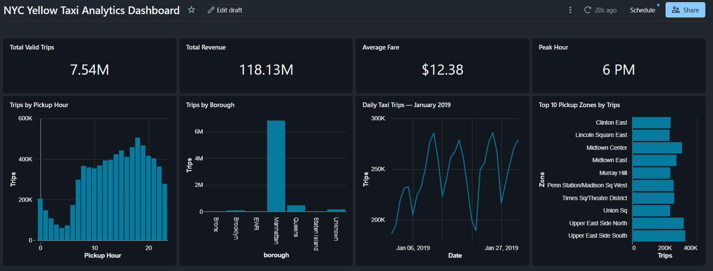

# NYC Yellow Taxi Data Engineering

An end-to-end data engineering project built using **Databricks, PySpark, SQL, Delta Lake, and Medallion Architecture**.

The project processes the **January 2019 NYC Yellow Taxi trip dataset** through a Bronze → Silver → Gold data pipeline and produces an analytical dashboard in Databricks.

---

## Project Overview

The objective of this project is to build a complete data engineering pipeline that:

- Ingests raw NYC Yellow Taxi data
- Stores the raw data in a Bronze Delta table
- Applies data quality rules in the Silver layer
- Creates analytical Gold tables using SQL
- Enriches taxi location data using a zone lookup dataset
- Builds a Databricks dashboard for business analysis
- Validates record counts and data quality throughout the pipeline

---

## Architecture

                    NYC Yellow Taxi CSV
                            │
                            ▼
                  ┌───────────────────┐
                  │   Bronze Layer    │
                  │                   │
                  │ yellow_taxi_bronze│
                  └─────────┬─────────┘
                            │
                            ▼
                  ┌───────────────────┐
                  │   Silver Layer    │
                  │                   │
                  │ yellow_taxi_silver│
                  │                   │
                  │ Data Quality      │
                  │ Validation        │
                  └─────────┬─────────┘
                            │
                            ▼
                  ┌───────────────────┐
                  │    Gold Layer     │
                  │                   │
                  │ Summary           │
                  │ Hourly            │
                  │ Daily             │
                  │ Weekday           │
                  │ Pickup Locations  │
                  │ Borough           │
                  └─────────┬─────────┘
                            │
                            ▼
                  ┌───────────────────┐
                  │    Dashboard      │
                  │                   │
                  │ NYC Yellow Taxi   │
                  │ Analytics         │
                  └───────────────────┘

## Technologies Used

| Technology | Purpose |
|---|---|
| Databricks Free Edition | Data engineering and analytics platform |
| PySpark | Data ingestion and transformation |
| SQL | Gold-layer analytical transformations |
| Delta Lake | Storage for Bronze and Silver tables |
| Python | Data processing and validation |
| GitHub | Source control and project documentation |
| Databricks SQL Dashboard | Data visualization and reporting |

---

## Dataset

### Source

NYC Yellow Taxi trip data available in the Databricks sample dataset.

### Dataset Used

yellow_tripdata_2019-01.csv.gz

## Data Quality Validation

The pipeline keeps all Bronze records while assigning a quality status in the Silver layer.

### Record Reconciliation

| Layer | Records |
|---|---:|
| Bronze | 7,667,792 |
| Silver | 7,667,792 |

The Bronze and Silver record counts match.

### Silver Quality Results

| Record Quality | Records |
|---|---:|
| VALID | 7,542,777 |
| CHECK | 125,015 |
| Total | 7,667,792 |

Records classified as `CHECK` are retained in the Silver layer rather than being silently removed.

The individual validation flags identify which quality rule requires attention.

---

## Key Analytical Results

The Gold summary table is calculated using records classified as `VALID`.

| Metric | Result |
|---|---:|
| Valid Trips | 7,542,777 |
| Total Revenue | $118,127,219.66 |
| Total Tips | $13,801,434.42 |
| Average Trip Distance | 2.81 miles |
| Average Fare | $12.38 |
| Average Total Amount | $15.66 |
| Average Trip Duration | 16.55 minutes |

### Peak Pickup Hour

The highest number of trips occurred at:

**6 PM (18:00)**

with approximately **505,219 trips**.

### Top Pickup Zone

The highest-volume pickup zone in the January 2019 valid dataset was:

**Upper East Side South**

with **327,683 trips**.

---

## Databricks Dashboard

The project includes a published Databricks dashboard named:

**NYC Yellow Taxi Analytics Dashboard**

The dashboard contains:

- Total Valid Trips
- Total Revenue
- Average Fare
- Peak Pickup Hour
- Trips by Pickup Hour
- Trips by Borough
- Daily Taxi Trips for January 2019
- Top 10 Pickup Zones by Trips

### Dashboard Preview

## Repository Structure

yellow-taxi-data-engineering/
│
├── dashboard/
│
├── notebooks/
│   ├── 01_Yellow_Taxi_Ingestion.py
│   ├── 02_Yellow_Taxi_Silver.py
│   └── 03_Yellow_Taxi_Gold.sql
│
├── screenshots/
│   └── nyc-yellow-taxi-dashboard.png
│
└── README.md

## Key Data Engineering Concepts Demonstrated

This project demonstrates practical implementation of:

- Medallion Architecture
- Bronze / Silver / Gold data layers
- PySpark data ingestion
- PySpark transformations
- Data quality validation
- Record reconciliation
- Delta Lake tables
- SQL-based analytical transformations
- Data enrichment using lookup data
- Aggregations and business metrics
- Databricks dashboards
- GitHub source control
- Data pipeline documentation

---

## Project Scope and Limitations

- The analysis uses January 2019 Yellow Taxi data only.
- The project is implemented using Databricks Free Edition.
- The pipeline is designed as a portfolio data engineering project rather than a production deployment.
- The analysis focuses on the available fields in the selected dataset.
- `CHECK` records are retained in Silver but excluded from the Gold analytical metrics.
- The taxi zone lookup is used to enrich pickup location IDs with borough and zone names.
- No claims are made about causal relationships from the observed patterns.

---

## Future Improvements

Potential extensions to the project include:

- Add additional months of taxi data
- Implement incremental ingestion
- Add automated pipeline scheduling
- Add pipeline monitoring and alerting
- Add more comprehensive data quality reporting
- Add payment-type analysis
- Add pickup-to-dropoff route analysis
- Add additional dashboard filters
- Implement CI/CD for the project
- Add automated testing for transformations

---

## Author

**Thirumalesh**

Data Engineering Portfolio Project

Technologies: Databricks | PySpark | SQL | Delta Lake | GitHub
